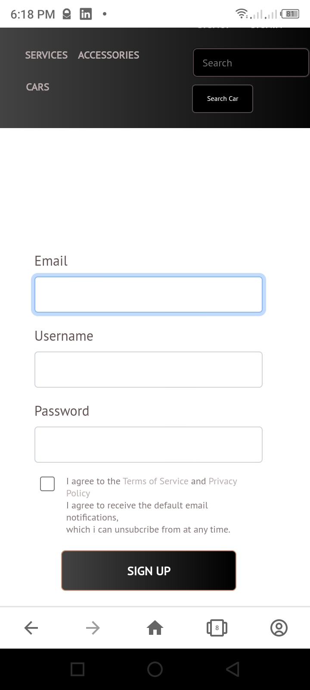
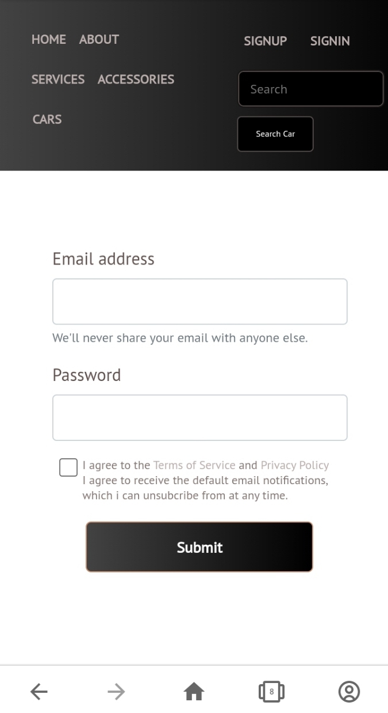
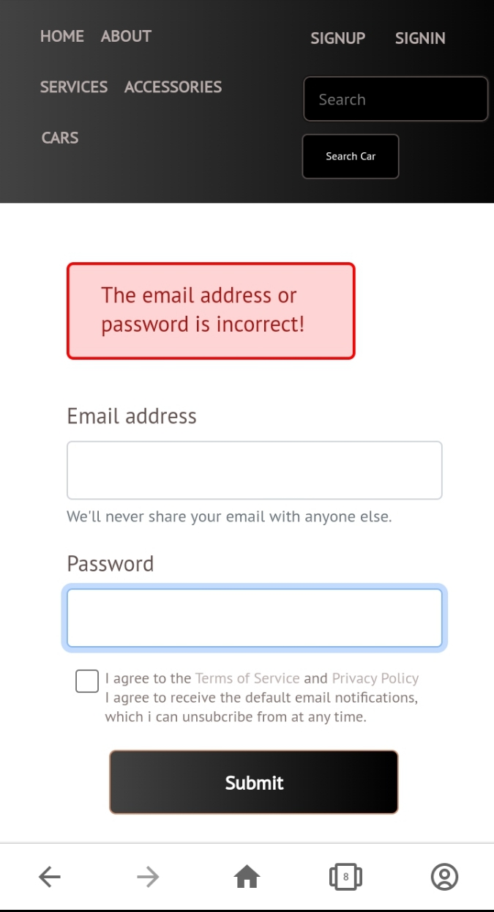
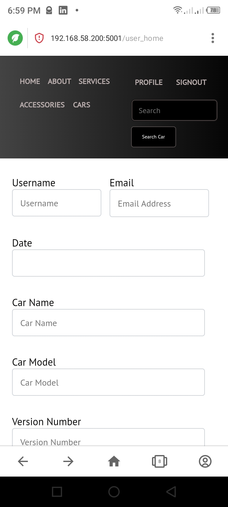

<h2> <b> Car Application </b> </h2> 


 
<br><br>


<br> <br>
<h2> <b> You can access the website here:</b> </h2> <a href="https://zsolutions-cars.herokuapp.com/"> <b> website link </b> </a>
<p>
 Click on the play image below to view the video of how the working process of this application works. 
</p>

[](https://youtu.be/NeE3K0V7Pys)


## Description 
<p>
    This is a python web application script that allows users to upload properties and data of cars, and their respective prices.
    It allows registered and non-registered users to view the prices, and the type of automobile they want to buy. 

    This application uses some necessary dependencies, which is stated below. 

</p>

## Design 
<ul>
<li> Signup Page </li> <br>
* This is the mobile page section which allows users to login, update and upload the type and model of the car they want to sell or display. 
</ul>
 <br> <br> <br>


<ul> 
<li> Login Page </li> <br> 
* This is the mobile page section that displays to the user if he/she want to login into the website. 
</ul> 

 <br> <br> <br>

<ul>
<li> Error Page </li> <br>
* This is the mobile page section which displays to the user that the password or email address typed in was incorrect. 

</ul>

 <br> <br> <br>


<ul> 
<li> Home Page </li> <br> 
* This is the mobile section for displaying the home page, and a form for it's users to upload cars, their model, their description, and the price. 

</ul>

 <br> <br> <br>


## Dependencies 

For this program to function effectively, the required dependencies are needed.

* bcrypt 
* flask 
* sqlite3 
* flask_cors 

## Pusing to Heroku 

```
$ heroku login
$ heroku create 
$ heroku rename <"app-new-name">
$ git add .  
$ git push heroku master 

```

## Installing 

* Clone the repository into your local working directory, then open a command line interface on your <b> Linux </b> or cmd on </b> Windows </b>, then type the command below. 

``` 
$ pip install -r requirements.txt 

``` 


### Execute The Main Script
* To execute the program, open a command line interface terminal on <b> Linux </b> or cmd on <b> Windows </b>, and type the command below. 

```
$ python app.py 

```

### Help

<p>
Contact me for references 
<ul>
    <li> <b> Email:</b> cmbonu@protonmail.com </li> 
    <li> <b>Number:</b> +234-7081-528827 </li>
    <li> <b> Number: </b> +234-9030-045587 </li> 
</ul>
</p>

### Authors

* Mbonu Chinedum E 
* Zsolutions


### Version History

* Version 1.0.0 

### License
* MIT 
* Apache 
* Linode 
* Amazon web services (AWS)

### Acknowledgments
<p>
   All thanks to God Almighty. 
</p>

